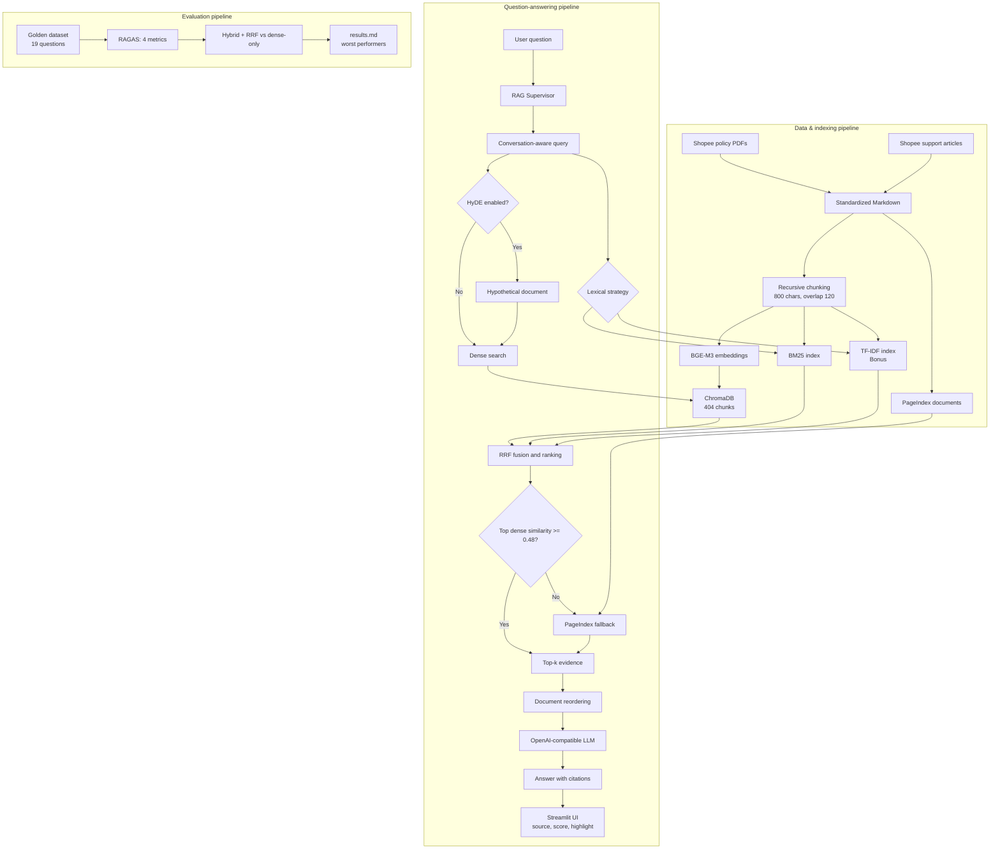

# Bài Tập Nhóm — E-commerce Support RAG Chatbot

## Mục Tiêu

Sau khi hoàn thành bài cá nhân, nhóm ngồi lại để xây dựng **1 trong 2 sản phẩm**:

---

## Yêu cầu 1: Sản phẩm nhóm RAG Chatbot

Xây dựng chatbot trả lời câu hỏi về chính sách thương mại điện tử và hỗ trợ khách hàng liên quan.

**Yêu cầu:**
- Giao diện chat (Streamlit / Gradio / Chainlit)
- Trả lời có citation (dựa trên Task 10)
- Hỗ trợ follow-up questions (conversation memory)
- Hiển thị source documents đã dùng

**Stack gợi ý:**
```
Chainlit/Streamlit → Retrieval (Task 9) → Generation (Task 10) → Display
```

---

## Yêu cầu 2: RAG Evaluation Pipeline

Sử dụng **1 trong 3 framework** sau để evaluate pipeline RAG của nhóm:

### Framework lựa chọn

| Framework | Cài đặt | Đặc điểm |
|-----------|---------|-----------|
| [DeepEval](https://github.com/confident-ai/deepeval) | `pip install deepeval` | Nhiều metric built-in, dễ integrate với pytest |
| [RAGAS](https://github.com/explodinggradients/ragas) | `pip install ragas` | Chuẩn industry cho RAG eval, 3 trục chính |
| [TruLens](https://github.com/truera/trulens) | `pip install trulens` | Dashboard UI, feedback functions mạnh |

### Yêu cầu Evaluation

1. **Tạo Golden Dataset** — tối thiểu 15 cặp Q&A (question, expected_answer, expected_context)
2. **Chạy evaluation** trên toàn bộ golden dataset với các metrics sau:
   - **Faithfulness** — câu trả lời có bám đúng context không?
   - **Answer Relevance** — câu trả lời có đúng câu hỏi không?
   - **Context Recall** — retriever có lấy đủ evidence không?
   - **Context Precision** — trong context lấy về, bao nhiêu % thực sự hữu ích?
3. **So sánh A/B** — chạy eval trên ít nhất 2 config khác nhau (ví dụ: có reranking vs không reranking, hoặc hybrid vs dense-only)
4. **Báo cáo** — bảng điểm + phân tích worst performers + đề xuất cải tiến

Xem code mẫu (DeepEval/RAGAS/TruLens) chi tiết trong `README.md` gốc mục "Yêu cầu 2".

### Deliverable Evaluation

- [x] File `group_project/evaluation/golden_dataset.json` — 19 cặp Q&A
- [x] File `group_project/evaluation/eval_pipeline.py` — script RAGAS có cache/resume
- [x] File `group_project/evaluation/results.md` — bảng điểm + worst performers
- [x] So sánh A/B: hybrid + RRF với dense-only

---

## Yêu Cầu Chung

1. **Tích hợp pipeline** từ bài cá nhân của các thành viên
2. **Demo hoạt động được** trong buổi trình bày (chạy local hoặc deploy)
3. **Evaluation pipeline** chạy được và có báo cáo kết quả
4. **Code push lên repository** chung của nhóm
5. **README** mô tả kiến trúc và phân công (điền bên dưới)

---

## Kiến Trúc Hệ Thống



### Lý do chọn kiến trúc

- **Dense BGE-M3 + lexical chạy song song:** dense bắt được ý nghĩa đa ngôn ngữ,
  còn BM25/TF-IDF giữ tốt từ khóa chính sách, mã phương thức và con số; chạy đồng
  thời giúp giảm độ trễ so với gọi hai retriever tuần tự.
- **RRF thay cho cộng score trực tiếp:** cosine similarity và lexical score khác
  thang đo; RRF hợp nhất theo thứ hạng nên không cần chuẩn hóa hai loại score.
- **Hiển thị dense similarity thay RRF:** similarity gần với mức khớp ngữ nghĩa
  và dễ giải thích cho người dùng; RRF chỉ là điểm hợp nhất nội bộ, không phải
  confidence xác suất.
- **PageIndex chỉ fallback dưới 0.48:** tránh gọi API ngoài khi Chroma đã đủ tự
  tin, nhưng vẫn có đường cứu cho câu khó hoặc khác cách diễn đạt.
- **Document reordering:** đặt evidence mạnh ở đầu/cuối prompt để giảm hiện tượng
  “lost in the middle”.

---

## Phân Công Công Việc

| Vai trò | Thành viên / MSSV | Nhiệm vụ | Trạng thái |
|---|---|---|---|
| Role 1 - Team Leader & RAG Architect | Phạm Gia Bảo — `2A202601506` | Điều phối, `supervisor.py`, Task 9, tích hợp và README | Hoàn thành |
| Role 2 - Data & Retrieval Specialist | Nguyễn Ngọc Hiệp — `2A202601156` | Task 1-5, chuẩn hóa dữ liệu, ChromaDB, BGE-M3, HyDE | Hoàn thành |
| Role 3 - Frontend & Chatbot Developer | Đoàn Tiến Thành — `2A202601222` | Streamlit `app.py`, Task 10, citation, highlight, memory | Hoàn thành |
| Role 4 - Evaluation & QA Engineer | Phạm Nam Khánh — `2A202601718` | Golden dataset 19 câu, RAGAS, A/B, test và báo cáo | Hoàn thành |
| Role 5 - Sparse & Advanced RAG Specialist | Đinh Hồng Đăng — `2A202601480` | Task 6-8, BM25, TF-IDF, RRF, PageIndex fallback | Hoàn thành |

---

## Bonus đã triển khai

| Tiêu chí | Hiện trạng | Bằng chứng / lý do |
|---|---|---|
| Lexical khác BM25 | Hoàn thành | TF-IDF có thể chọn từ sidebar; benchmark cho thấy BM25 Hit@5 1.000 so với TF-IDF 0.947, nên BM25 vẫn là mặc định. Xem `evaluation/lexical_results.md`. |
| HyDE | Hoàn thành | Sinh hypothetical document rồi ghép với query gốc để giảm lệch văn phong giữa câu hỏi hội thoại và văn bản chính sách. |
| Conversation memory | Hoàn thành | Supervisor dùng các lượt chat gần nhất để giải nghĩa follow-up nhưng giới hạn lịch sử nhằm tránh phình prompt. |
| UI source, score, highlight | Hoàn thành | Hiển thị nguồn, dense similarity/lexical rank và highlight evidence khớp query; HTML tài liệu được escape trước khi thêm `<mark>`. |
| Deploy online | Hoàn thành | [Streamlit chatbot public](https://2a2026shopee-policy-rag.streamlit.app/); landing page Vercel đã được cấu hình để nhúng URL này. |

Cả năm tiêu chí tương ứng **20/20 điểm bonus đã có bằng chứng trong repo và URL demo công khai**.

### Demo Online

- **URL:** [https://2a2026shopee-policy-rag.streamlit.app/](https://2a2026shopee-policy-rag.streamlit.app/)
- **Cách chấm nhanh:** đặt một câu hỏi chính sách, mở “Chi Tiết Tài Liệu &
  Trích Dẫn” để xem citation, source, dense similarity, lexical rank và evidence
  highlight; tiếp tục bằng một follow-up để kiểm tra conversation memory.

### Kết quả RAGAS A/B (19 câu)

| Metric | Hybrid + RRF | Dense-only |
|---|---:|---:|
| Faithfulness | 0.962 | 0.892 |
| Answer Relevance | 0.916 | 0.930 |
| Context Recall | 0.768 | 0.832 |
| Context Precision | 0.618 | 0.636 |
| Average | 0.816 | 0.822 |

Dense-only nhỉnh hơn 0.006 điểm trung bình, nhưng hybrid + RRF tăng Faithfulness
0.071. Vì vậy không nên tuyên bố RRF luôn tốt hơn: trên corpus nhỏ này lexical
retrieval đưa thêm chunk cùng chủ đề nhưng chưa đủ chính xác, làm recall/precision
giảm. Hướng cải tiến tiếp theo là source-aware reranking hoặc multilingual
cross-encoder.

Báo cáo kỹ thuật: `evaluation/test_results.md`, `evaluation/lexical_results.md` và
`evaluation/results.md`.

---

## Hướng Dẫn Chạy

```bash
# Cài đặt dependencies
pip install -r requirements.txt

# Tạo .env từ file mẫu rồi điền một LLM provider và PAGEINDEX_API_KEY
copy .env.example .env

# Upload corpus PageIndex lần đầu (manifest local ngăn upload trùng)
python -m src.task8_pageindex_vectorless

# Chạy app
streamlit run app.py

# Chạy toàn bộ regression test
python -m unittest discover -s tests -v

# Chạy RAGAS A/B trên toàn bộ 19 câu
python -m group_project.evaluation.eval_pipeline
```

Trên macOS/Linux, thay `copy` bằng `cp`. HyDE mặc định tắt để không phát sinh
thêm lượt gọi LLM; có thể bật từ sidebar Streamlit. Evaluation tắt HyDE và
PageIndex ở cả hai nhánh để phép so sánh A/B chỉ đo tác động của BM25 + RRF.
RAGAS ghi cache theo từng batch/câu, vì vậy có thể chạy lại cùng lệnh để tiếp tục
sau khi provider chậm hoặc tiến trình bị ngắt. Hướng dẫn deploy nằm tại
`deployment/README.md`.

---

## Lưu ý

Hãy giữ lại repo này nếu như bạn học track 3 giai đoạn 2, chúng ta sẽ phát triển tiếp dự án lên knowledge graph để khắc phục các câu hỏi hóc búa khi có các câu hỏi khó.
